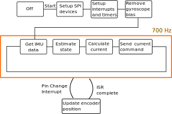

# Readme uniwheel_maevarm_m2 V1
This project uses 4 IMUs (MPU9250, invensense) and the MAEVARM M2 (Jonathan Fiene) to estimate the state (roll, pitch, yaw) of a uniwheel robot. This is done using the algorythms described in the following papers written by Dr.Sc. Sebastian Trimpe:

- [Accelerometer-based Tilt Estimation of a Rigid Body with only Rotational Degrees of Freedom](https://atlas.is.localnet/confluence/download/attachments/60359322/Trimpe__accelerometer-based_tilt_estimation.pdf?version=1&modificationDate=1560506324322&api=v2) 
- [The Balancing Cube](https://atlas.is.localnet/confluence/download/attachments/60359322/Trimpe_balancingCube.pdf?version=1&modificationDate=1560506364929&api=v2 )

## Installation
The code is written in C and can be compiled/flashed relatively easily on the M2. The M2 is used in combination with Linux. The following steps should be undertaken prior to compiling/flashing the M2:

- Execute the following command in the command prompt, this will install the necessary programs to flash and compile the M2:
```bash
sudo apt install gcc-avr avrdude avr-libc dfu-programmer build-essential dfu-util
```
- for monitoring values "screen" is used:
```bash
sudo apt install screen
```
- to communicate via usb (so for using screen), the user needs to be added to the dialout group (log out and in after executing following command):
 ```bash
sudo usermod -a -G dialout $USER
```

For any issues please refer to the more extensive guide on how to setup Linux for the M2 here [M2 help page (local)](https://atlas.is.localnet/confluence/display/ICS/MAEVARM+M2).

## Compiling and flashing the code
- To compile the code, CD to the direction
```bash
cd /ownCloud/Sync/...
```
- when compling for the first time, or when a .h file has changed, execute the following command:
```bash
sudo make clean
```
- compile the program:
```bash
sudo make
```
- Set the M2 into flash mode. This is done by holding the push button on the M2 untill the green LED shines. Then the push button can be released and the orange LED should light up
- Flash the M2:
```bash
sudo make flash
```
- Reset the M2 by pressing the pushbutton, it should start program.
### Running the program
- It is mandatory to connect to the M2 for displaying values etc. otherwise the program will not run
```bash
sudo screen /dev/ttyACMx
```
- Note: x will most likely be 0
- In general, the messages should guide themselves, however, see a walkthrough below:
1. "waiting for screen to connect, press (c)"  will be shown. When c is pressed, the program is started.
2. The motors are being calibrated right now. This should give some audible noise
3. If you need calibration on your accelerometers, the accelerometers will calibrate now. Be sure to set the pendulum in the position specified in config.h!!
4. The bias of the sensors will be printed and asked for confirmation. If it looks "normal"  press (s)
5. The value set in config.h for pendulum angle will be printed, check if this is still correct, especially when using encoder. If you agree, press (s)
6. The script will calculate the angle of the pendulum using only the accelerometers, used for gyroscope integration. if the value looks correct, press (s)
7. the pendulum should now stabilize


## Files
### Core/Random files
- Makefile
- license.txt
- readme.md
- .gitignore (file to ignore file formats when using git)
- screenlog_changer.m
    - changes screenlog files from screen to a usable txt and makes plot. does not always work. needs work
    
### Source files
* main.c, main file with main function and while loop. Functions are executed here and output is sent in this file
* mpu9250.c main file for configuring and getting data from the IMU's
* m_spi.c slightly modified spi library from Jonathan Fiene [(link)](https://atlas.is.localnet/confluence/download/attachments/60359322/m_spi.c?version=1&modificationDate=1565958247414&api=v2) so it works with multiple IMU's
*  m_usb.c USB streaming library from Jonathan Fiene
* matrix_calculations.c contains elementary matrix calculations not standard available in C
* state_estimation.c uses acc. and gyro. data to estimate angle of inverted pendulum (2D!). also defines constrainAngle function (wrap to -180,180)
* udriver.c used for setting up and sending/receiving commands from udriver board
* control.c used for calculating necessary current for motor with LQR control and an integrator.
### Header files
* m_general.h Generic header file for M2
* config.h Config file for this project. Configurable parameters: 
  1. `INIT_WAIT`, wait time after initialization of each sensor
  2. `LOOP_FREQ`, sampling frequency of the loop (ToDo: fix clock divisor automatically)
  3. `CALIB_NUM_SAMPLES` amount of samples to use to calculate bias of gyroscopes
  4. `NUM_SENSORS`  Number of sensors
  5. `IMU_PINx` pins used for all IMUs
  6. `IMUx_X/Y` position of all IMUs
  7. `MOTOR_KV` KV of used motor
  8. `MOTOR_TORQUE_CONSTANT` motor Kt
  9. `MAX_CURRENT_MOTOR` max current sent to motor in script
  10. `FUSION_TUNING_PARAMETER` parameter used for fusing gyro+acc data
  11. `MD` chip select pin of udriver board
  12. `accel_r` and `gyro_r` ranges of accel. and gyro. check mpu9250.h for possibilities
  13. `accel_f` and `gyro_f` filters of accel. and gyro. check mpu9250.h for possibilities
  14. `PROTRACTOR_ANGLE` angle of the pendulum in initial state (measured with digital protractor) 
* m_spi.h contains some macro's for chip (de)select, pinmodes and has typedefs for SPI frequency and pinning for M2.
* m_usb.h USB streaming library header file
* mpu9250.h header file of mpu9250.c. Contains register values of MPU9250 and typedefs for acceleration and gyroscope ranges/filters. 
* Matrix calculation.h, header file of matrix_calculations.c
* state_estimation.h, header file of state_estimation.c, also defines PI and PI/2
* udriver.h, header file of udriver.c
* control.h, header file of control.c



